<h1 align="center">DiagramKit</h1>

<p align="center">给 Agent 用的报告级示意图工具</p>

<p align="center">
  <a href="README.md">English</a>
  ·
  <a href="#安装">安装</a>
  ·
  <a href="#快速开始">快速开始</a>
  ·
  <a href="#效果预览">效果预览</a>
</p>

<p align="center">
  
  
  
</p>

---

用户给出材料，或者说清楚要讲明白什么；Agent 想清楚这张图该表达什么，DiagramKit 负责把它画出来：按 Word 页面或幻灯片的尺寸排好，文字是能看清的字号，输出 PNG、SVG、PDF。

DiagramKit 画的是结构，不是数字：

- 事情怎么运转：带步骤、判断和异常的流程，工艺或生产线，各方之间的消息往来。
- 事情怎么组织：组织架构、交易结构、合同体系、系统的组成、类和数据表。
- 什么时候、为什么：带日期的进度计划、按时间排列的事件、问题的成因、按可能性与影响排列的风险、资金从哪来到哪去。

数字的趋势、对比和分布是图表的事，不是示意图的事。

## 效果预览

下面这些图只写了内容，没有指定任何外观：放进 Word 页面的图默认整份文档一套色系，字体是 Times New Roman 加本机的宋体。

| | | |
|:---:|:---:|:---:|
| <sub><strong>带判断的流程</strong></sub> | <sub><strong>分阶段的流程</strong></sub> | <sub><strong>交易结构</strong></sub> |
| 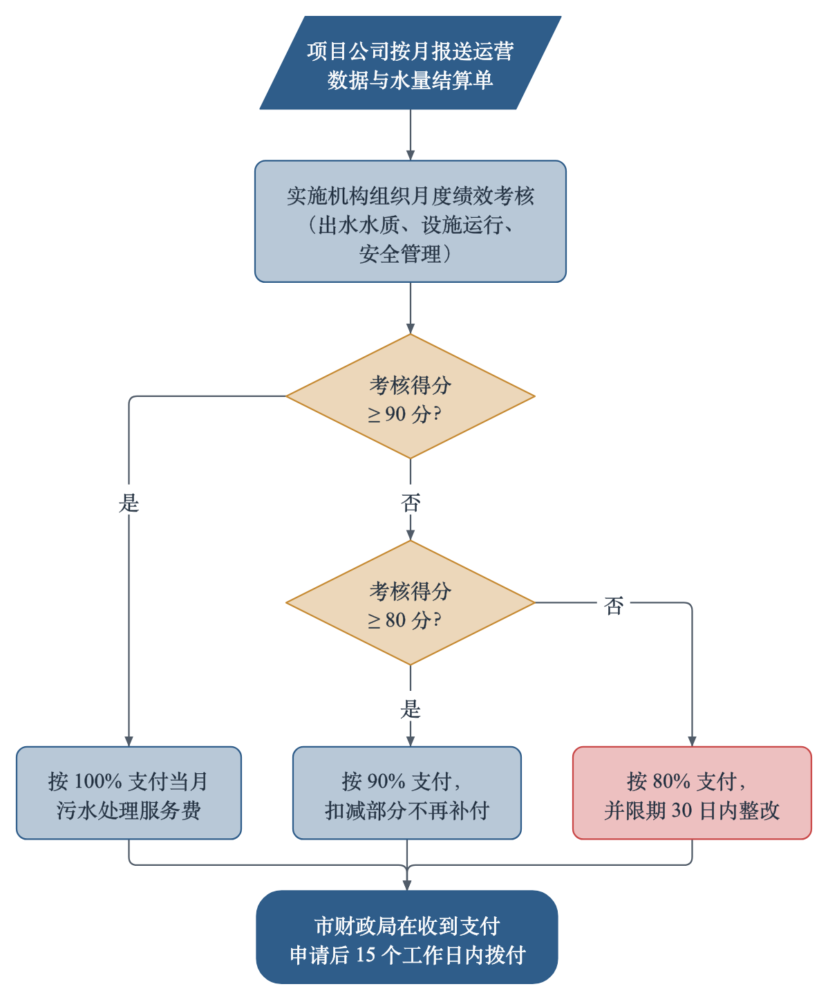 | 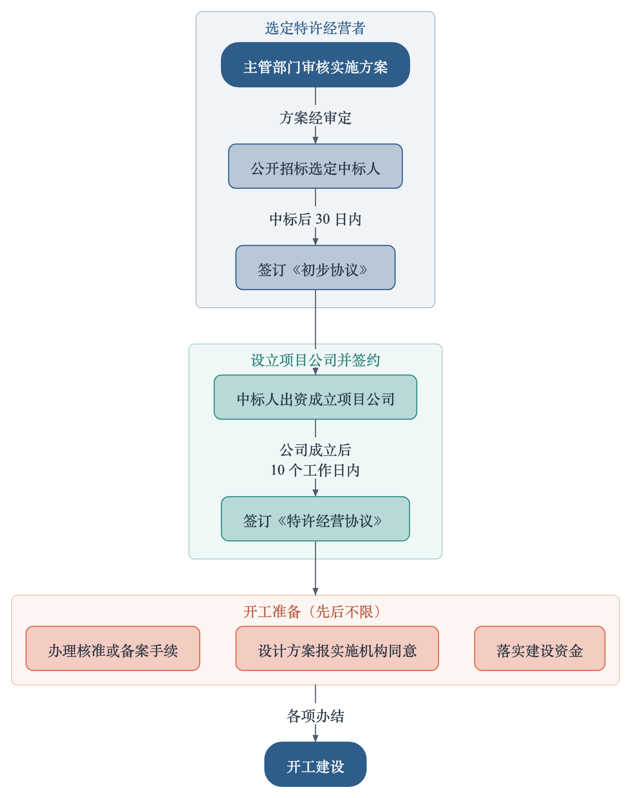 | 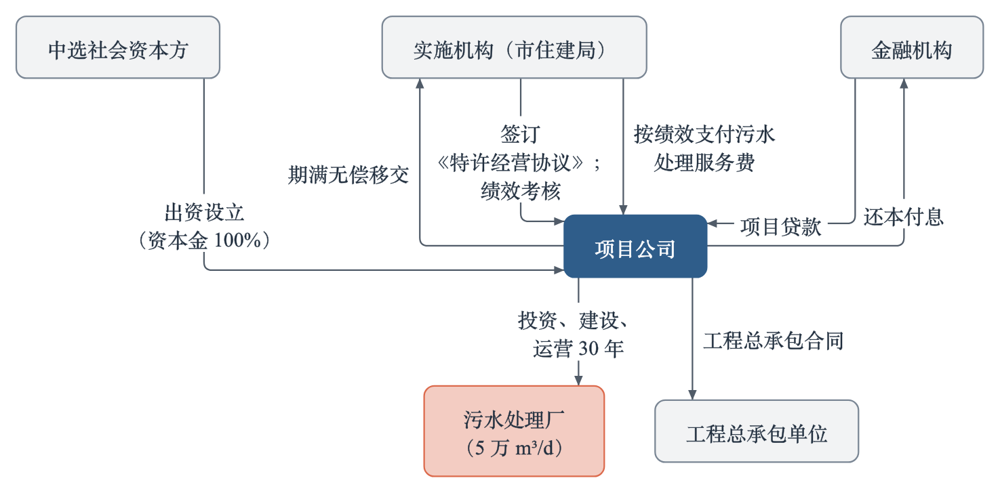 |
| <sub><strong>风险矩阵</strong></sub> | <sub><strong>资金来源与运用</strong></sub> | <sub><strong>实施进度</strong></sub> |
| 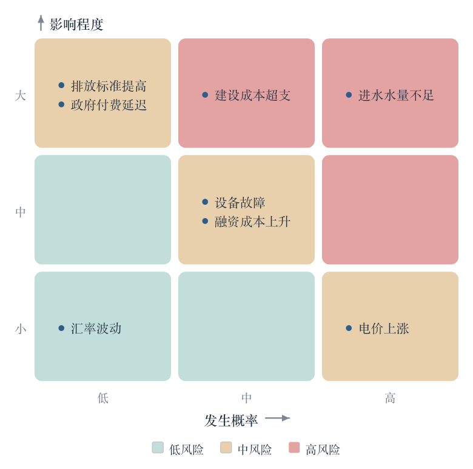 | 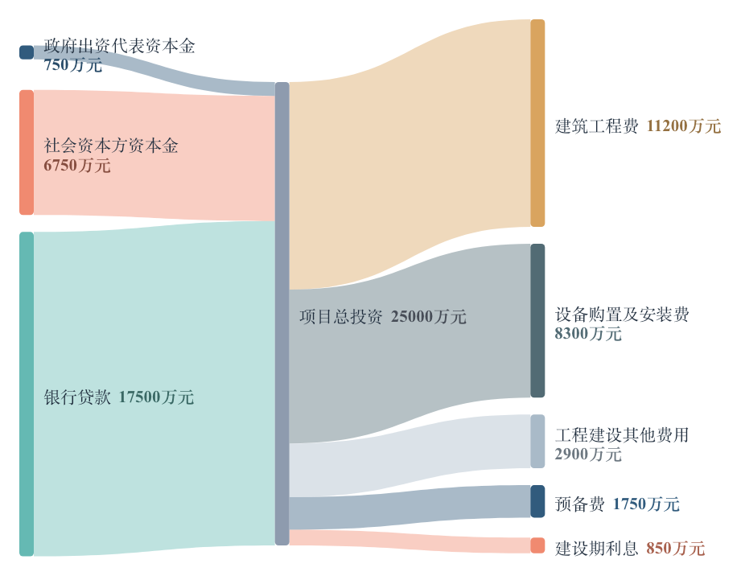 | 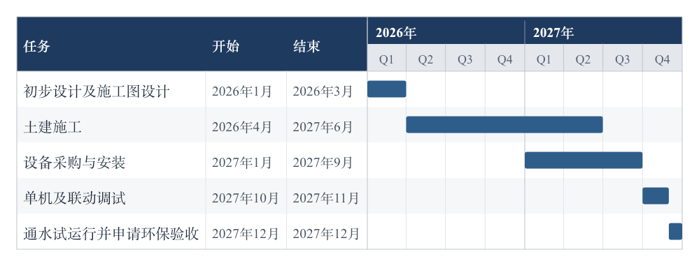 |
| <sub><strong>组织架构</strong></sub> | <sub><strong>政策时间线</strong></sub> | <sub><strong>成因分析</strong></sub> |
| 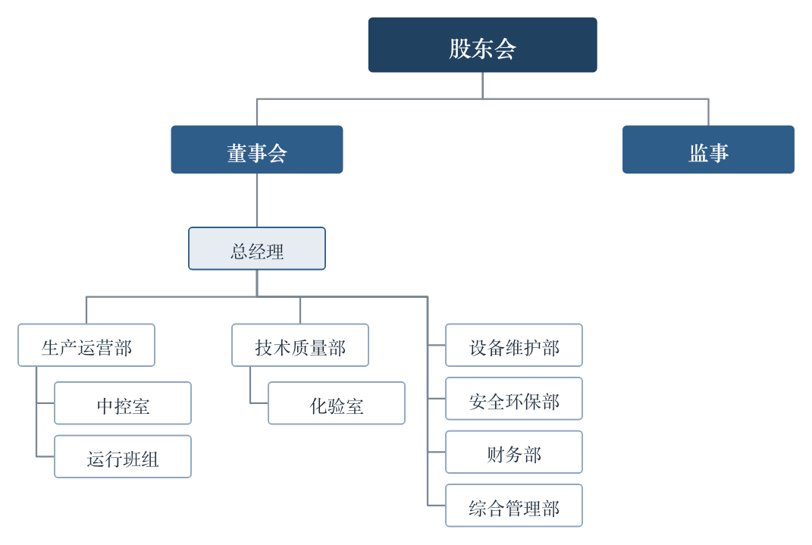 | 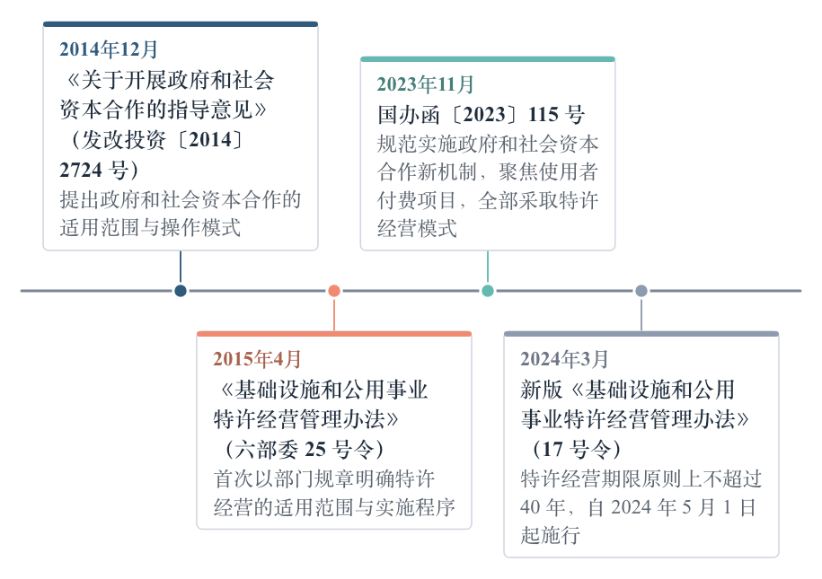 | 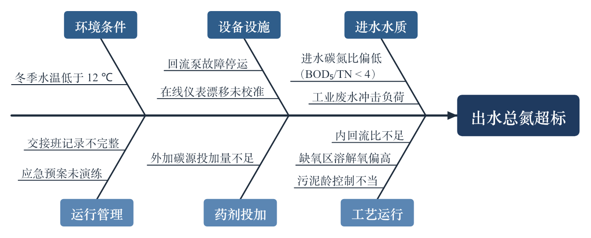 |
| <sub><strong>同一张流程图，手绘风</strong></sub> | <sub><strong>时序图</strong></sub> | <sub><strong>类图</strong></sub> |
| 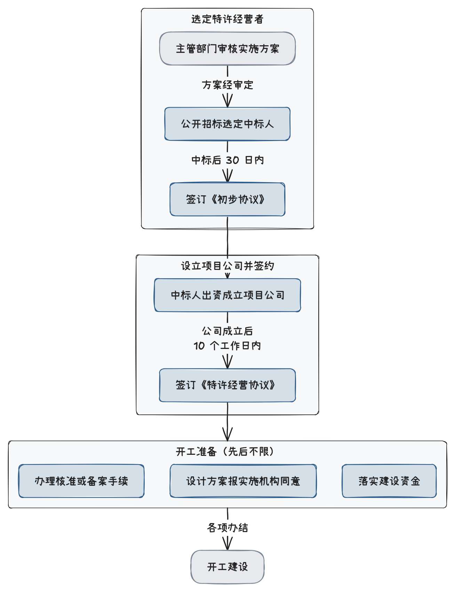 | 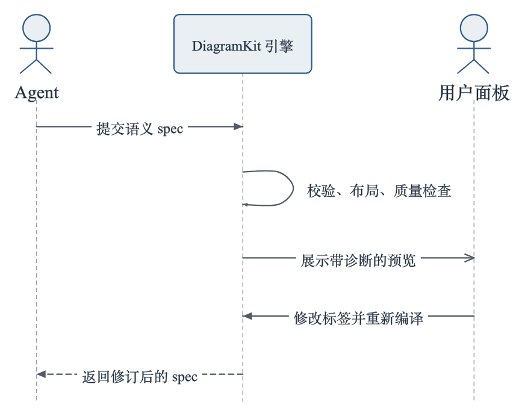 | 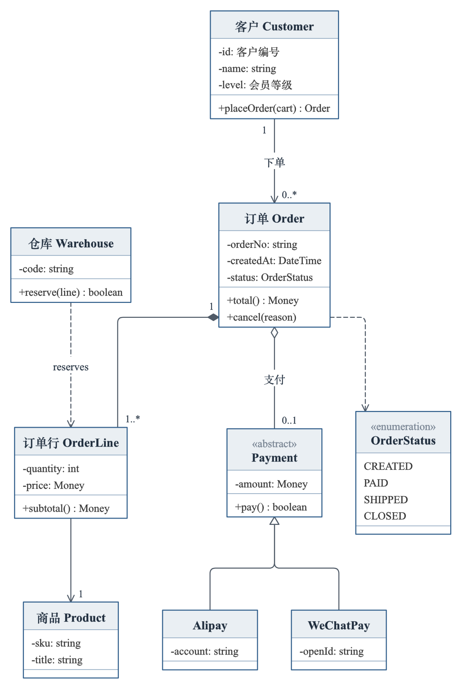 |

前九张图的源文件就在旁边的 [`examples/showcase`](examples/showcase) 里。还支持：思维导图、ER 图、分层架构图、C4、象限图、饼图、雷达图、矩形树图、看板、用户旅程图、需求图。

## 安装

DiagramKit 需要 **Node.js 22.16 或更高版本**。

### 1. 安装命令行

```bash
npm install -g @dztabel/diagramkit
diagramkit --version
```

看到类似下面的输出，说明命令行装好了：

```text
diagramkit 0.1.0 (contract 1)
```

### 2. 安装一个 Agent 技能

技能随 npm 包一起分发，所以它总是和装着的命令行版本一致。

#### 2.1 Codex

```bash
diagramkit sync-skill --out ~/.agents/skills/diagramkit
```

打开 Codex，输入 `$diagramkit`，能用 `Tab` 选中这个技能就说明可以用了。没出现的话，按 `Cmd+K` / `Ctrl+K` 选 `Force Reload Skills`，或者重开 Codex。

#### 2.2 Claude Code

```bash
diagramkit sync-skill --out ~/.claude/skills/diagramkit
```

打开 Claude Code，输入 `/diagramkit`，能选中这个技能就说明可以用了。没出现的话，运行 `/reload-skills` 再试。

`sync-skill` 只往新目录里写。以后升级命令行时，先删掉旧的技能目录，再运行一次上面的命令。

## 快速开始

### 1. 让 Agent 写报告时顺手配图

```text
$diagramkit 根据我的笔记把实施方案写成一份 Word 报告，在有助于读者理解的地方配图：审批流程、进度计划、谁和谁签什么合同。
/diagramkit 根据我的笔记把实施方案写成一份 Word 报告，在有助于读者理解的地方配图：审批流程、进度计划、谁和谁签什么合同。
```

### 2. 把一段文字画成一张图

```text
$diagramkit 把第四节描述的付费流程画成一张流程图，放进报告里。
/diagramkit 把第四节描述的付费流程画成一张流程图，放进报告里。
```

### 3. 给幻灯片配图

```text
$diagramkit 把项目组织架构和三年路线图各做成一张图，用在 16:9 的幻灯片里。
/diagramkit 把项目组织架构和三年路线图各做成一张图，用在 16:9 的幻灯片里。
```

### 4. 修改一张图

```text
$diagramkit 把流程图里的“评审”拆成“技术评审”和“财务评审”两步，重新出图。
/diagramkit 把流程图里的“评审”拆成“技术评审”和“财务评审”两步，重新出图。
```

读材料、想清楚图该表达什么、写图的描述文件、出图、检查结果，都由 Agent 来做。

## 技术细节

Agent 写一份语义化的 JSON 描述——只说有哪些方框、它们之间是什么关系，从不指定谁放在哪——然后运行：

```bash
diagramkit validate figure.json
diagramkit build figure.json --out ./figure-1 --format png
```

DiagramKit 负责排版和检查（标签是否在框内、连线是否互相避让、文字在页面上是多大），并写出：

```text
figure-1/diagram.png            图本身，已是印刷尺寸
figure-1/diagram-manifest.json  插入文档时的尺寸和图题
figure-1/diagram.html           查看页，带“开始编辑”按钮
figure-1/quality.json           检查了什么、发现了什么
figure-1/build-result.json
```

`--format all` 会另外输出 `diagram.svg` 和矢量的 `diagram.pdf`。`diagramkit example <名称>` 能打印出每种图型的一份完整示例，`diagramkit schema` 打印完整的契约。

**页面。** 图是按它要放进去的页面来排的：默认是 Word 页面（A4 竖版；也可以要横版、A3 或自定义版心），`--output ppt` 是 16:9 幻灯片，`--output standalone` 是独立图片。在 Word 页面上，主要文字印出来是 9 pt，绝不低于 6.5 pt；一页放不下的图会在内容的自然边界处折行或分成几张，而不是缩到看不清。

**外观。** 放进 Word 页面的图不写风格时按 `business` 着装：整份文档一套色系，每种图型在这套色系里用自己合适的上色方式。其它文档风格：`mono`（黑白印刷、公文）、`guofeng`、`soft`、`notebook`（手绘）和 `report`（各图型自己的常规外观）。每种图型也都可以用手绘笔来画。

**字体。** 不写 `--font` 时，放进 Word 页面的图用 Times New Roman 加本机装有的宋体（macOS 上是 Songti SC，Windows 上是宋体 SimSun，装有 Noto Serif CJK 的机器用它），和报告正文一致。幻灯片、独立图片，以及没有宋体的机器，用随包的思源黑体 Noto Sans SC。`--font "Noto Sans SC"` 让每张图都用随包字体——同一张图在任何机器上都一样。一张图实际用了什么字体，记在它的 `manifest.json` 里。

PNG 和 PDF 与打开它的机器装了什么字体无关。SVG 里只内嵌随包字体的子集：在没有宋体的机器上用浏览器打开时，文字由内嵌的后备字体显示，每一行仍排在原来的宽度里。

**编辑。** `diagramkit panel figure.json --open` 在浏览器里打开一个本地面板，可以改图的内容和外观；`diagramkit serve <目录>` 为一个目录里的图提供服务，这样从已出图的查看页就能点进面板。两者都只在本机监听。

## 常见问题

```bash
diagramkit doctor
```

`doctor` 报告 Node 版本、原生渲染器和正在使用的字体——其中 `font.wordPage` 是本机放进 Word 页面的图会用的字体。

- **`npm install` 失败，或 `doctor` 说没有原生渲染器。** DiagramKit 用 `skia-canvas` 出图，它会为当前平台装一个预编译的二进制：macOS（Apple 芯片和 Intel）、Windows（x64 和 ARM64）、Linux（x64 和 ARM64）。本次发布在 macOS Apple 芯片和 Windows 11 ARM64 上验证过。
- **`DKT001: Font is unavailable`。** `--font` 写的字体本机没有装。去掉 `--font`，或者写一个装着的字体。
- **Node 版本低于 22.16。** 请安装当前的 Node.js LTS。

报告问题时，请附上 `diagramkit --version`、`diagramkit doctor` 的输出，以及能复现问题的最小描述文件。

## 仓库范围

这个公开仓库里是文档、预览图及其源文件，以及发版流程。

npm 包里是构建后的命令行、编辑面板、Agent 技能、示例，以及字体和它们的许可证。源代码、测试、参考图库和开发文档既不在包里，也不在这个仓库里——见 [`docs/public-boundary.md`](docs/public-boundary.md)。

## 许可

DiagramKit 以构建后的形式通过 npm 分发，是专有软件，可以免费安装和使用。第三方组件和字体各自保留原有许可（见包内的 `THIRD-PARTY-NOTICES.md`）。这个仓库提供安装和使用它所需的文档与预览素材。
